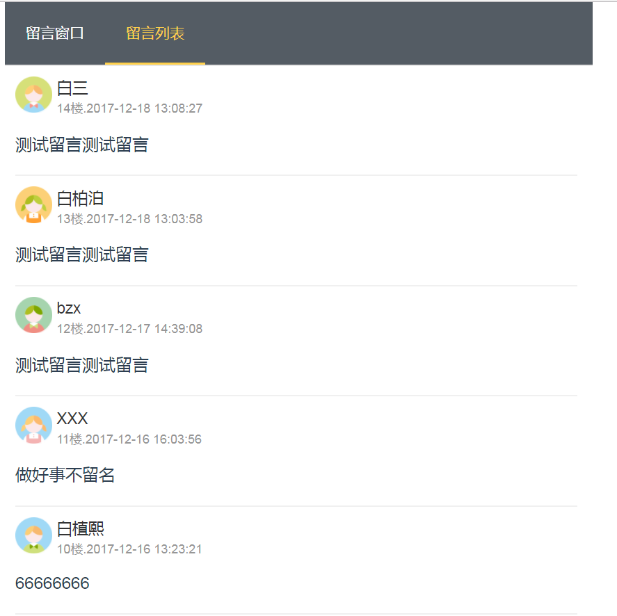

# message

> A Vue.js project

This is my first Vue's project
thought the project is so easy,....sorry my english so bad,so I
don't konw to say.
用中文讲，就是没啥可说的。
## 项目地址 [www.bai3.xyz/comment](http://www.bai3.xyz/comment)
> 线上版本因为前后端图片路由问题导致图片不显示，所以线上没更新。可以自行下载github库自行安装运行
### 技术栈
#### 前端
- vue
- element-ui
- vue-router
- webpack

#### 后端
- Django
- rest framework

#### 项目拷贝
##### install dependencies
npm install

##### serve with hot reload at localhost:8002
npm run dev

##### build for production with minification
npm run build

 

 

